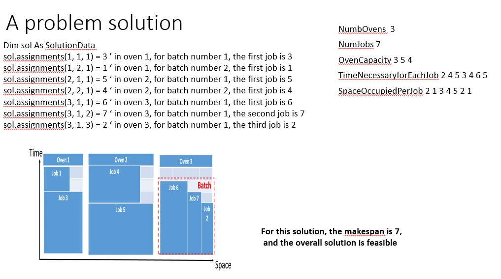
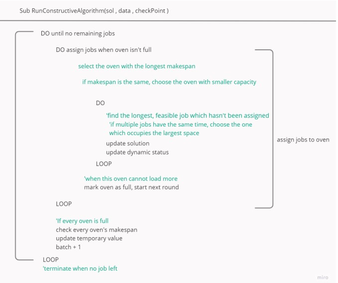
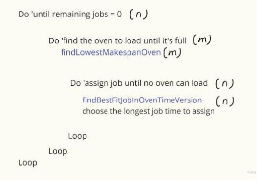
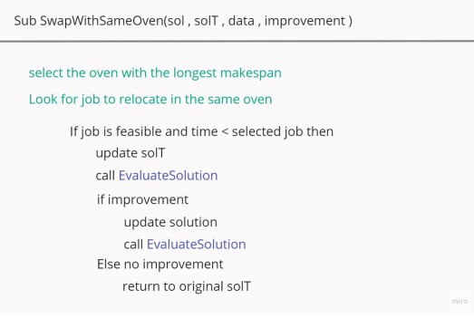
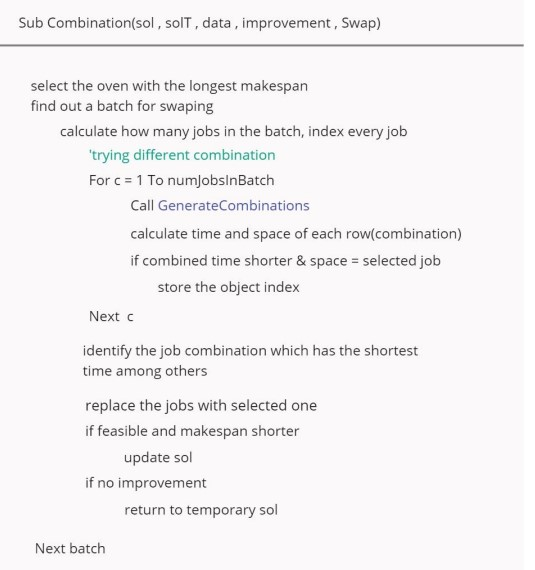
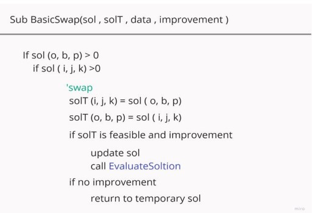
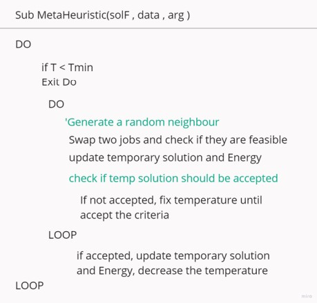

# Building heuristic algorithms to deal with scheduling problem
Built three algorithms (constructive heuristic, local serach and meta heuristic) to deal with bakery scheduling problem to minimise baking time(makespan minimisation). 

### Define the question
Trays for same cookie duration are called job. Each job with a duration 'c' and space 's' in the oven.  
Each oven has a capacity 'S'. The goal is sheduling all jobs.  

### Define variables and functions

  

The initial solution is assigning the job and oven by order unsorted, and create a new whereas no space for current batch.

### First Solution - Constructive heuristic 
This solution priortise the longest duration jobs and choose the oven with the longest makespan. Keep stacking jobs until the batch of oven is full then move to next oven. Once every oven has been loaded, a new batch is created. The process finished when all jobs are asigned. 

 

The capacity of this algorithm is O(mn*n) which m = num of oven, n = num of jobs.  

 
Compared to initial solution, this method improves 31% on average of makespan. 

### Second Solution - Loacal Search
Local search algorithm explores the search space by iteratively improving a solution based on local changes rather than considering the entire search space.
This method is built upon the first constructive result to search for better solutions. The strategies are as followed:  
- Swap within the same oven: focus on adjustment within single oven. 

 

- Combination: The algorithm detects evaluates combinations of jobs that have the same capacity and lower baking time within or across ovens. 

 

- Basic swap: Exchange of any two jobs across the entire scheduling solution.

 

In this phase, a termininated criteria is carried to ensure a finite search span and computational efficiency. After 5 iterations without enhancement, the search moves into next stragy until finishes.  

The complexity of this solution is O(m2n7), this method improves 8% on average of makespan. 

 

### Metaheuristics
Metaheuristics offer an escape from being confined to local optima. Simulated annealing is chosen in this step. Analogous to thermally annealing metals, this method heats the solution space to enable dynamic exploration, cooling it to solidify improvements gradually.  

Experimental analyses with varying Tmax, Tmin, and cooling rates have been conducted to optimise the solution space exploration. Lower Tmax values have been
observed to necessitate increased iterations, with corresponding adjustments in Tmin.  

 

The degree of complexity highly depends on the parameters and iteration times defined by the automatic algorithm mechanism. 

This method improves 24% on average of makespan. 

### Analysis and conclusion 

The constructive algorithm demonstrates a remarkable capacity for near-optimal solutions with minimal
computational demand. 
The local search algorithm served as a fine-tuning mechanism that improved the quality of the initial schedules. 
Metaheuristic in spite of starting with a worse initial solution, through exhaustive exploration among the considerable numbers of potential solutions, the performance was almost equally superior to the solution generated without any constraints.

